# BỘ GIÁO DỤC VÀ ĐÀO TẠO

# TRƯỜNG ĐẠI HỌC QUY NHƠN

# KHOA CÔNG NGHỆ THÔNG TIN

<br>
<br>
<br>

# BÁO CÁO ĐỒ ÁN CÔNG NGHỆ 2

## Đề tài: Nâng cấp Website Quản Lý Bóng Rổ

<br>

**Giảng viên hướng dẫn:** Đoàn Thị Thu Cúc  
**MSSV:** 4551190039  
**Sinh viên thực hiện:** Nguyễn Hồ Khôi Nguyên  
**Lớp:** Kỹ thuật phần mềm K45  

<br>
<br>
<br>

**GIA LAI, 2026**

---

# MỤC LỤC

**CHƯƠNG 1: TỔNG QUAN NÂNG CẤP TRONG ĐỒ ÁN CÔNG NGHỆ 2**  
1.1. Giới thiệu chương  
1.2. Bối cảnh phát triển từ Đồ án Công nghệ 1 sang Đồ án Công nghệ 2  
1.3. Mục tiêu nâng cấp hệ thống  
1.4. Phạm vi báo cáo  
1.5. Danh sách chức năng mới đã hoàn thành  
1.6. Công nghệ bổ sung sử dụng trong giai đoạn nâng cấp  
1.7. Kết luận chương  

**CHƯƠNG 2: PHÂN TÍCH VÀ THIẾT KẾ CÁC CHỨC NĂNG MỚI**  
2.1. Giới thiệu chương  
2.2. Chức năng bảng xếp hạng động  
2.3. Chức năng xuất báo cáo PDF  
2.4. Chức năng trợ lý AI bóng rổ  
2.5. Chức năng trực quan hóa đội hình  
2.6. Cải tiến giao diện điều hướng  
2.7. Cấu trúc dữ liệu bổ sung  
2.8. Tổng hợp API endpoint mới  
2.9. Kết luận chương  

**CHƯƠNG 3: TRIỂN KHAI, KIỂM THỬ VÀ ĐÁNH GIÁ**  
3.1. Giới thiệu chương  
3.2. Môi trường triển khai  
3.3. Kết quả triển khai chức năng bảng xếp hạng động  
3.4. Kết quả triển khai chức năng xuất PDF  
3.5. Kết quả triển khai chức năng AI chatbot  
3.6. Kết quả triển khai chức năng đội hình trực quan  
3.7. Kiểm thử chức năng mới  
3.8. Đánh giá kết quả đạt được  
3.9. Hạn chế còn tồn tại  
3.10. Hướng phát triển tiếp theo  

**TỔNG KẾT BÁO CÁO**  

**TÀI LIỆU THAM KHẢO**

---

# CHƯƠNG 1: TỔNG QUAN NÂNG CẤP TRONG ĐỒ ÁN CÔNG NGHỆ 2

## 1.1. Giới thiệu chương

Chương này trình bày tổng quan quá trình nâng cấp Website Quản Lý Bóng Rổ trong giai đoạn Đồ án Công nghệ 2. Hệ thống đã được xây dựng nền tảng ở Đồ án Công nghệ 1 với các chức năng cơ bản như xác thực, phân quyền, quản lý đội bóng, cầu thủ và lịch thi đấu. Trong Đồ án Công nghệ 2, trọng tâm không còn nằm ở các chức năng CRUD cơ bản mà chuyển sang các chức năng mở rộng nhằm tăng giá trị sử dụng thực tế của hệ thống.

Các nội dung chính của chương gồm:

- Bối cảnh phát triển từ phiên bản cũ sang phiên bản nâng cấp.
- Mục tiêu của giai đoạn Đồ án Công nghệ 2.
- Phạm vi các chức năng mới được trình bày trong báo cáo.
- Công nghệ bổ sung được sử dụng để hoàn thiện các chức năng mới.

## 1.2. Bối cảnh phát triển từ Đồ án Công nghệ 1 sang Đồ án Công nghệ 2

Ở Đồ án Công nghệ 1, hệ thống Website Quản Lý Bóng Rổ đã hoàn thành nền tảng chính của một ứng dụng quản lý, bao gồm quản lý người dùng, đội bóng, cầu thủ và lịch thi đấu. Tuy nhiên, hệ thống khi đó vẫn chủ yếu phục vụ thao tác lưu trữ và quản lý dữ liệu, chưa khai thác sâu dữ liệu để hỗ trợ phân tích, báo cáo, trực quan hóa và tương tác thông minh.

Trong Đồ án Công nghệ 2, hệ thống được nâng cấp theo kế hoạch phát triển trong file `ROADMAP.md`. Các chức năng mới tập trung vào bốn hướng chính:

- Phân tích dữ liệu và bảng xếp hạng động.
- Xuất dữ liệu thành báo cáo PDF.
- Tích hợp trợ lý AI để hỏi đáp dựa trên dữ liệu hệ thống.
- Trực quan hóa đội hình bóng rổ trên sân.

Những nâng cấp này giúp website không chỉ là công cụ quản lý dữ liệu mà còn trở thành một hệ thống hỗ trợ theo dõi, phân tích và khai thác thông tin bóng rổ hiệu quả hơn.

Sơ đồ tổng quan quá trình nâng cấp từ Đồ án Công nghệ 1 sang Đồ án Công nghệ 2:

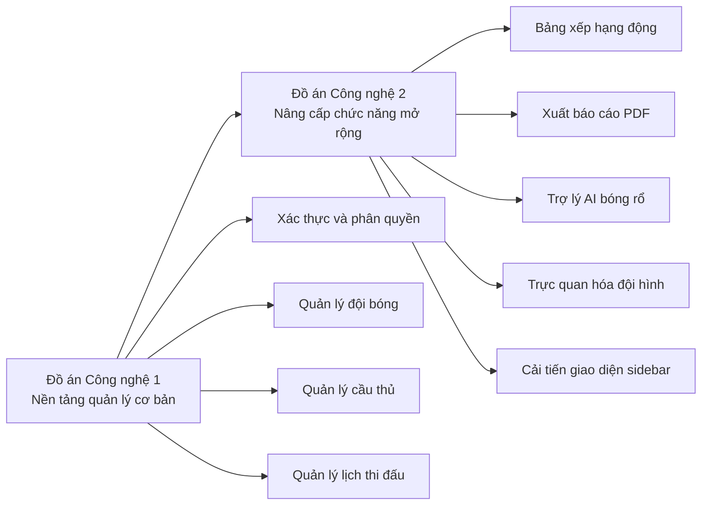

## 1.3. Mục tiêu nâng cấp hệ thống

Mục tiêu tổng quát của Đồ án Công nghệ 2 là mở rộng Website Quản Lý Bóng Rổ thành một hệ thống có khả năng phân tích, báo cáo, hỗ trợ người dùng và hiển thị dữ liệu trực quan hơn.

Các mục tiêu cụ thể:

- Xây dựng bảng xếp hạng động dựa trên số trận thắng, thua và tỷ lệ thắng của từng đội.
- Bổ sung khả năng xuất báo cáo PDF cho các nhóm dữ liệu quan trọng.
- Tích hợp AI chatbot để người dùng đặt câu hỏi về đội bóng, cầu thủ, trận đấu và thống kê.
- Xây dựng trang đội hình trực quan hiển thị cầu thủ theo vị trí trên sân bóng rổ.
- Cải thiện trải nghiệm giao diện, đặc biệt là điều hướng, bố cục và khả năng sử dụng.
- Đảm bảo các chức năng mới hoạt động trên nền tảng MERN Stack hiện có.

## 1.4. Phạm vi báo cáo

Báo cáo này chỉ trình bày các chức năng mới được phát triển trong giai đoạn Đồ án Công nghệ 2. Các chức năng nền tảng đã hoàn thành ở Đồ án Công nghệ 1 như đăng nhập, đăng ký, phân quyền, quản lý đội bóng, quản lý cầu thủ và quản lý lịch thi đấu chỉ được nhắc đến khi cần làm dữ liệu đầu vào cho chức năng mới.

Phạm vi báo cáo gồm:

- Bảng xếp hạng động và thống kê đội bóng.
- Xuất báo cáo PDF.
- AI chatbot hỗ trợ hỏi đáp dữ liệu bóng rổ.
- Trực quan hóa đội hình.
- Cải tiến giao diện điều hướng bằng sidebar.
- Các API, dữ liệu và công nghệ liên quan trực tiếp đến những chức năng trên.

## 1.5. Danh sách chức năng mới đã hoàn thành

Các chức năng mới đã hoàn thành theo kế hoạch trong `ROADMAP.md` gồm:

| STT | Chức năng | Trạng thái | Công nghệ chính |
|---|---|---|---|
| 1 | Bảng xếp hạng động | Hoàn thành | Express.js, MongoDB, React |
| 2 | Xuất báo cáo PDF | Hoàn thành | PDFKit, Express.js |
| 3 | Trợ lý AI bóng rổ | Hoàn thành | Groq API, Express.js, React |
| 4 | Trực quan hóa đội hình | Hoàn thành | React, SVG |
| 5 | Cải tiến giao diện điều hướng | Hoàn thành | React, CSS |

Sơ đồ nhóm chức năng mới trong Đồ án Công nghệ 2:

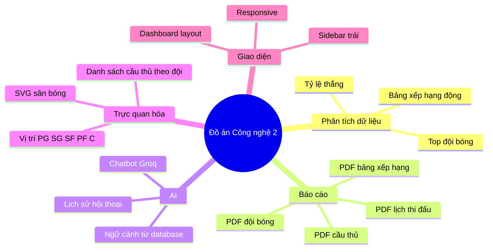

## 1.6. Công nghệ bổ sung sử dụng trong giai đoạn nâng cấp

Ngoài nền tảng MERN Stack đã có từ giai đoạn trước, Đồ án Công nghệ 2 bổ sung một số công nghệ và thư viện sau:

### 1.6.1. PDFKit

PDFKit được sử dụng ở backend để tạo file PDF trực tiếp từ dữ liệu trong MongoDB. Thư viện này cho phép tạo tiêu đề, bảng dữ liệu, định dạng font chữ, phân trang và trả file PDF về trình duyệt dưới dạng `blob`.

### 1.6.2. Groq SDK

Groq SDK được sử dụng để tích hợp mô hình ngôn ngữ vào hệ thống. Backend lấy dữ liệu đội bóng, cầu thủ và trận đấu từ database, xây dựng ngữ cảnh rồi gửi đến Groq API để tạo câu trả lời bằng tiếng Việt.

### 1.6.3. Recharts

Recharts được sử dụng cho các biểu đồ thống kê trực quan trong hệ thống, hỗ trợ hiển thị dữ liệu bằng biểu đồ cột, đường và tròn.

### 1.6.4. SVG trong React

SVG được sử dụng để vẽ sân bóng rổ và vị trí cầu thủ trên sân. Cách làm này giúp giao diện nhẹ, dễ tùy chỉnh và không cần phụ thuộc vào hình ảnh tĩnh.

### 1.6.5. CSS cải tiến giao diện

Giao diện được cải tiến theo hướng dashboard hiện đại, sử dụng sidebar bên trái thay cho navbar ngang để tránh tình trạng quá nhiều menu bị chen chúc. Sidebar giúp hệ thống dễ mở rộng thêm chức năng trong tương lai.

Sơ đồ kiến trúc công nghệ sau nâng cấp:

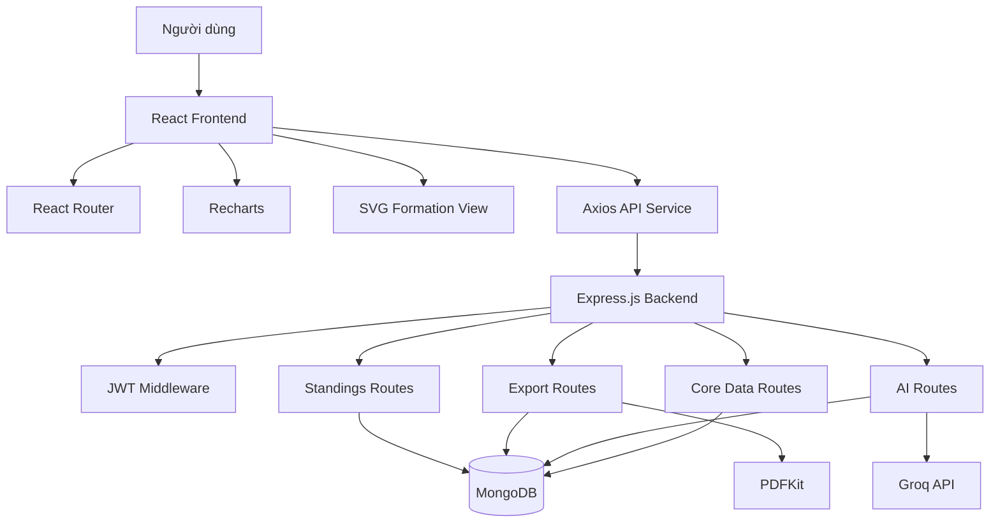

## 1.7. Kết luận chương

Chương 1 đã trình bày bối cảnh, mục tiêu và phạm vi nâng cấp hệ thống trong Đồ án Công nghệ 2. Các chức năng mới được xây dựng nhằm tăng khả năng phân tích, báo cáo, tương tác và trực quan hóa dữ liệu bóng rổ. Đây là bước phát triển quan trọng giúp website vượt ra khỏi phạm vi quản lý dữ liệu cơ bản và tiến gần hơn đến một hệ thống hỗ trợ vận hành thực tế.

---

# CHƯƠNG 2: PHÂN TÍCH VÀ THIẾT KẾ CÁC CHỨC NĂNG MỚI

## 2.1. Giới thiệu chương

Chương này phân tích chi tiết các chức năng mới được phát triển trong Đồ án Công nghệ 2. Mỗi chức năng được trình bày theo các nội dung: mục tiêu, dữ liệu đầu vào, xử lý backend, hiển thị frontend, API liên quan và ý nghĩa đối với người dùng.

## 2.2. Chức năng bảng xếp hạng động

### 2.2.1. Mục tiêu chức năng

Bảng xếp hạng động giúp người dùng theo dõi thứ hạng các đội bóng dựa trên thành tích thi đấu. Thay vì chỉ xem số trận thắng và thua rời rạc trong danh sách đội bóng, hệ thống tổng hợp dữ liệu và sắp xếp đội theo tỷ lệ thắng, tạo thành bảng xếp hạng trực quan.

### 2.2.2. Dữ liệu sử dụng

Chức năng sử dụng dữ liệu từ collection `teams`, bao gồm:

- Tên đội.
- Thành phố.
- Huấn luyện viên.
- Số trận thắng.
- Số trận thua.

Ngoài ra, hệ thống có thể truy vấn collection `matches` để tính thêm các thông số chi tiết như điểm ghi được, điểm bị ghi và độ mạnh lịch thi đấu.

### 2.2.3. Công thức tính toán

Tổng số trận:

```text
totalGames = wins + losses
```

Tỷ lệ thắng:

```text
winRate = wins / totalGames * 100
```

Nếu đội chưa có trận nào, tỷ lệ thắng được đặt là 0 để tránh lỗi chia cho 0.

### 2.2.4. Luồng xử lý backend

Backend thực hiện các bước:

1. Nhận request từ client tại endpoint `/api/standings`.
2. Kiểm tra token đăng nhập bằng middleware `verifyToken`.
3. Lấy danh sách đội bóng từ MongoDB.
4. Tính tổng số trận và tỷ lệ thắng của từng đội.
5. Sắp xếp đội theo tỷ lệ thắng giảm dần.
6. Nếu tỷ lệ thắng bằng nhau, ưu tiên đội có số trận thắng nhiều hơn.
7. Gắn thứ hạng cho từng đội.
8. Trả dữ liệu bảng xếp hạng về frontend.

Sơ đồ luồng xử lý bảng xếp hạng động:

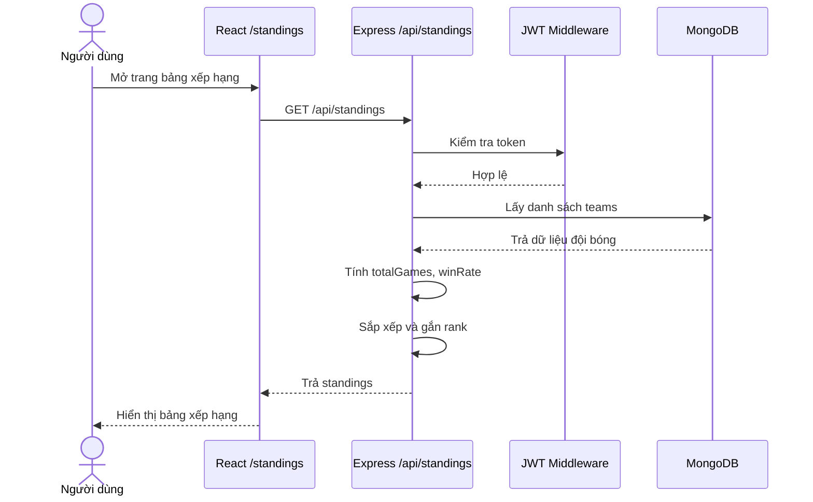

### 2.2.5. Thiết kế frontend

Frontend hiển thị bảng xếp hạng tại route:

```text
/standings
```

Giao diện gồm:

- Bảng danh sách đội bóng theo thứ hạng.
- Cột số trận thắng, thua, tổng trận.
- Thanh hiển thị tỷ lệ thắng.
- Các thẻ tổng quan gồm đội dẫn đầu, số đội, tổng lượt trận và tỷ lệ thắng trung bình.
- Nút cập nhật lại dữ liệu.
- Thời gian cập nhật cuối cùng.

### 2.2.6. API liên quan

| Method | Endpoint | Chức năng | Quyền |
|---|---|---|---|
| GET | `/api/standings` | Lấy bảng xếp hạng động | User |
| GET | `/api/standings/team/:teamId` | Lấy thống kê chi tiết của một đội | User |
| GET | `/api/standings/sos/:teamId` | Tính độ mạnh lịch thi đấu | User |

### 2.2.7. Ý nghĩa chức năng

Chức năng bảng xếp hạng động giúp hệ thống có tính phân tích hơn, hỗ trợ người dùng nhanh chóng nhận biết đội nào đang dẫn đầu, đội nào có hiệu suất tốt và thứ hạng thay đổi ra sao sau các trận đấu.

Sơ đồ thuật toán xếp hạng:

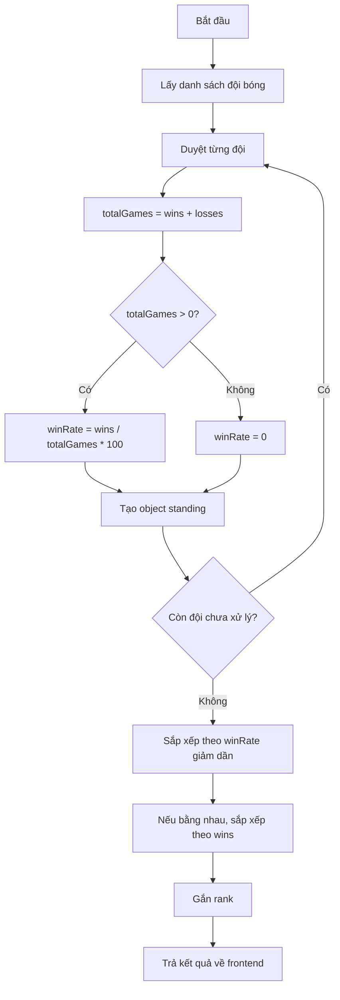

## 2.3. Chức năng xuất báo cáo PDF

### 2.3.1. Mục tiêu chức năng

Chức năng xuất báo cáo PDF giúp người dùng lưu trữ, in ấn và chia sẻ dữ liệu của hệ thống dưới dạng file. Đây là chức năng quan trọng trong môi trường quản lý thực tế, khi dữ liệu cần được tổng hợp thành tài liệu báo cáo.

### 2.3.2. Các loại báo cáo đã triển khai

Hệ thống hỗ trợ bốn loại báo cáo:

- Báo cáo bảng xếp hạng.
- Báo cáo danh sách đội bóng.
- Báo cáo danh sách cầu thủ.
- Báo cáo lịch thi đấu.

### 2.3.3. Luồng xử lý backend

Backend sử dụng PDFKit để tạo file PDF theo các bước:

1. Người dùng chọn loại báo cáo trên giao diện.
2. Frontend gửi request đến API export tương ứng.
3. Backend kiểm tra token đăng nhập.
4. Backend truy vấn dữ liệu từ MongoDB.
5. Dữ liệu được định dạng thành bảng hoặc danh sách trong file PDF.
6. Backend thiết lập header `Content-Type: application/pdf`.
7. File PDF được trả về frontend dưới dạng stream.
8. Frontend tạo `Blob URL` và tự động tải file xuống máy người dùng.

Sơ đồ tuần tự xuất báo cáo PDF:

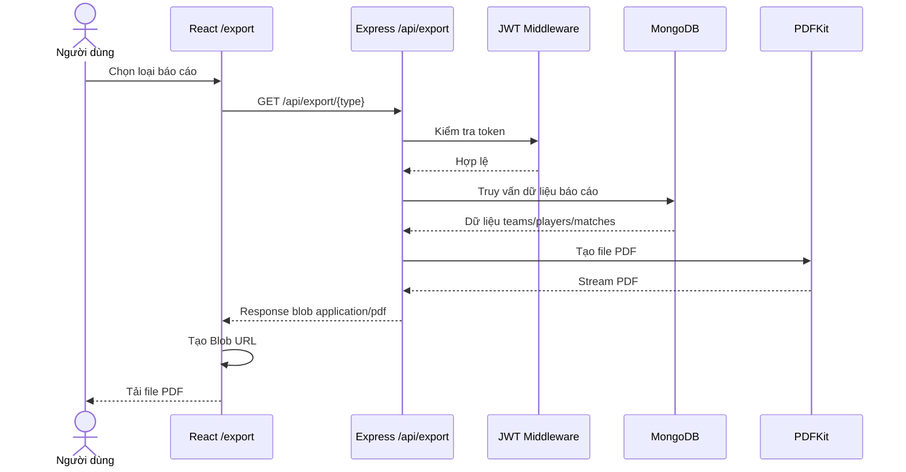

### 2.3.4. Hỗ trợ tiếng Việt trong PDF

Để hỗ trợ tiếng Việt tốt hơn, backend có cơ chế đăng ký font TrueType từ các vị trí phổ biến trên Windows, macOS và Linux:

```text
C:\Windows\Fonts\arial.ttf
C:\Windows\Fonts\arialbd.ttf
/System/Library/Fonts/Supplemental/Arial.ttf
/System/Library/Fonts/Supplemental/Arial Bold.ttf
/Library/Fonts/Arial.ttf
/Library/Fonts/Arial Bold.ttf
/usr/share/fonts/truetype/dejavu/DejaVuSans.ttf
/usr/share/fonts/truetype/dejavu/DejaVuSans-Bold.ttf
```

Nếu không tìm thấy font phù hợp, hệ thống sử dụng font mặc định của PDFKit. Cách thiết kế này giúp chức năng xuất PDF hoạt động ổn định hơn khi chuyển project giữa Windows, macOS và Linux.

### 2.3.5. Thiết kế frontend

Trang xuất báo cáo nằm tại route:

```text
/export
```

Giao diện gồm các thẻ chức năng:

- Bảng xếp hạng.
- Danh sách đội.
- Danh sách cầu thủ.
- Lịch thi đấu.

Mỗi thẻ có tiêu đề, mô tả và nút tải xuống. Khi người dùng nhấn nút, hệ thống gọi API tương ứng và tải file PDF về.

### 2.3.6. API liên quan

| Method | Endpoint | Chức năng | Quyền |
|---|---|---|---|
| GET | `/api/export/standings` | Xuất báo cáo bảng xếp hạng | User |
| GET | `/api/export/teams` | Xuất báo cáo danh sách đội | User |
| GET | `/api/export/players` | Xuất báo cáo danh sách cầu thủ | User |
| GET | `/api/export/matches` | Xuất báo cáo lịch thi đấu | User |

Sơ đồ phân loại báo cáo PDF:

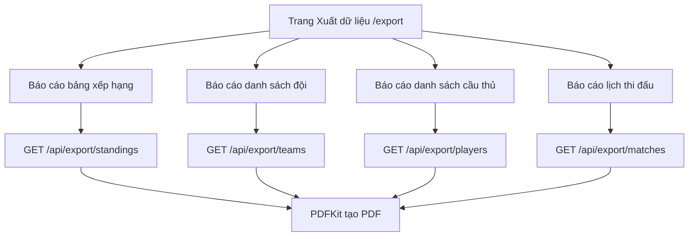

### 2.3.7. Ý nghĩa chức năng

Chức năng xuất PDF giúp hệ thống phù hợp hơn với nhu cầu báo cáo cuối kỳ, báo cáo nội bộ hoặc lưu trữ dữ liệu ngoại tuyến. Đây là bước nâng cấp quan trọng so với phiên bản chỉ hiển thị dữ liệu trên giao diện web.

## 2.4. Chức năng trợ lý AI bóng rổ

### 2.4.1. Mục tiêu chức năng

Trợ lý AI bóng rổ được xây dựng nhằm giúp người dùng tương tác với dữ liệu hệ thống bằng ngôn ngữ tự nhiên. Thay vì phải tự tìm kiếm thủ công trong nhiều trang, người dùng có thể đặt câu hỏi như:

- Cầu thủ nào ghi điểm nhiều nhất?
- Đội nào có thành tích tốt nhất?
- Gần đây có những trận đấu nào?
- So sánh tình hình giữa các đội.
- Gợi ý nhận xét về đội bóng hoặc cầu thủ.

### 2.4.2. Công nghệ sử dụng

Chức năng sử dụng:

- Groq SDK ở backend.
- Model `llama-3.1-8b-instant`.
- React để xây dựng giao diện chat.
- MongoDB để lưu lịch sử hội thoại.

### 2.4.3. Dữ liệu ngữ cảnh cung cấp cho AI

Trước khi gửi câu hỏi đến Groq API, backend lấy dữ liệu từ hệ thống gồm:

- Danh sách đội bóng và thành tích thắng thua.
- Danh sách cầu thủ và thống kê điểm.
- Danh sách trận đấu gần đây.

Dữ liệu này được ghép thành một đoạn ngữ cảnh, sau đó đưa vào system prompt. Nhờ vậy AI có thể trả lời dựa trên dữ liệu hiện có trong hệ thống thay vì chỉ trả lời chung chung.

Sơ đồ nguồn dữ liệu cung cấp cho AI:

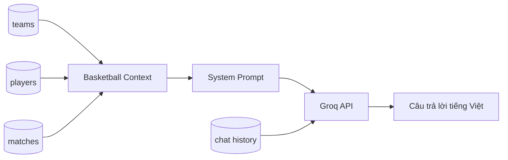

### 2.4.4. Thiết kế prompt

System prompt yêu cầu AI:

- Đóng vai trợ lý bóng rổ cho hệ thống quản lý giải đấu.
- Trả lời dựa trên dữ liệu đội, cầu thủ và trận đấu hiện tại.
- Ưu tiên trả lời bằng tiếng Việt.
- Trả lời ngắn gọn, dễ hiểu và có tính hỗ trợ người dùng.

### 2.4.5. Lưu lịch sử chat

Hệ thống bổ sung model `Chat` để lưu lịch sử trò chuyện. Mỗi phiên chat gồm:

- `userId`: người dùng sở hữu lịch sử chat.
- `messages`: danh sách tin nhắn gồm role, content và timestamp.
- `context`: loại ngữ cảnh hội thoại.
- `createdAt`, `updatedAt`: thời gian tạo và cập nhật.

Để tránh lịch sử quá dài gây tốn token khi gọi AI, hệ thống chỉ giữ lại 20 tin nhắn gần nhất.

### 2.4.6. Luồng xử lý chức năng chat

1. Người dùng nhập câu hỏi trên giao diện chat.
2. Frontend gửi request đến `/api/ai/chat`.
3. Backend kiểm tra token đăng nhập.
4. Backend lấy hoặc tạo phiên chat của người dùng.
5. Backend lưu câu hỏi của người dùng vào lịch sử.
6. Backend truy vấn dữ liệu đội, cầu thủ, trận đấu để tạo ngữ cảnh.
7. Backend gửi system prompt và lịch sử hội thoại đến Groq API.
8. AI trả về câu trả lời.
9. Backend lưu câu trả lời vào lịch sử chat.
10. Frontend hiển thị câu trả lời trong khung chat.

Sơ đồ tuần tự chức năng AI chatbot:

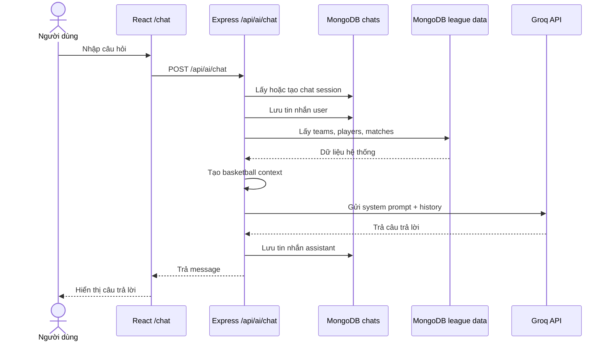

### 2.4.7. API liên quan

| Method | Endpoint | Chức năng | Quyền |
|---|---|---|---|
| POST | `/api/ai/chat` | Gửi câu hỏi và nhận câu trả lời AI | User |
| GET | `/api/ai/chat/history` | Lấy lịch sử trò chuyện | User |
| DELETE | `/api/ai/chat/clear` | Xóa lịch sử trò chuyện | User |

### 2.4.8. Ý nghĩa chức năng

Chức năng AI chatbot giúp hệ thống có khả năng tương tác hiện đại hơn. Người dùng không cần nhớ chính xác vị trí dữ liệu trong hệ thống mà có thể hỏi trực tiếp bằng ngôn ngữ tự nhiên. Đây là điểm nâng cấp nổi bật của Đồ án Công nghệ 2, thể hiện xu hướng tích hợp AI vào ứng dụng web.

Sơ đồ trạng thái của phiên chat:

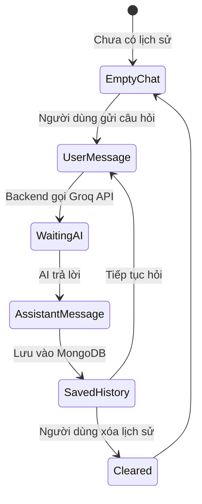

## 2.5. Chức năng trực quan hóa đội hình

### 2.5.1. Mục tiêu chức năng

Trang đội hình trực quan giúp người dùng xem cầu thủ của từng đội theo vị trí thi đấu trên sân bóng rổ. Thay vì chỉ xem danh sách cầu thủ dạng bảng, chức năng này hiển thị đội hình trên mô hình sân, giúp dữ liệu dễ hiểu và sinh động hơn.

### 2.5.2. Route chức năng

Frontend sử dụng route:

```text
/formation/:teamId
```

Từ trang danh sách đội bóng, người dùng có thể nhấn nút xem đội hình để chuyển sang trang trực quan hóa đội hình của đội tương ứng.

### 2.5.3. Dữ liệu sử dụng

Chức năng sử dụng:

- API lấy chi tiết đội bóng: `/api/teams/:id`.
- API lấy cầu thủ theo đội: `/api/players/team/:teamId`.

Lưu ý: hai API trên ở backend là endpoint đọc dữ liệu public, nhưng trang giao diện `/formation/:teamId` trên frontend vẫn được bọc bởi `PrivateRoute`, vì vậy người dùng cần đăng nhập khi truy cập chức năng này từ ứng dụng.

Dữ liệu cầu thủ gồm:

- Tên cầu thủ.
- Số áo.
- Vị trí thi đấu.
- Điểm, kiến tạo, rebounds.

### 2.5.4. Thiết kế vị trí trên sân

Hệ thống định nghĩa tọa độ cố định cho năm vị trí cơ bản trong bóng rổ:

| Vị trí | Ký hiệu | Ý nghĩa |
|---|---|---|
| Point Guard | PG | Hậu vệ dẫn bóng |
| Shooting Guard | SG | Hậu vệ ghi điểm |
| Small Forward | SF | Tiền phong phụ |
| Power Forward | PF | Tiền phong chính |
| Center | C | Trung phong |

Mỗi vị trí được gắn với một tọa độ trên sân SVG. Nếu đội có cầu thủ ở vị trí tương ứng, cầu thủ được hiển thị bằng vòng tròn màu và số áo. Nếu chưa có cầu thủ, vị trí đó được hiển thị trạng thái trống.

Sơ đồ ánh xạ vị trí cầu thủ lên sân:

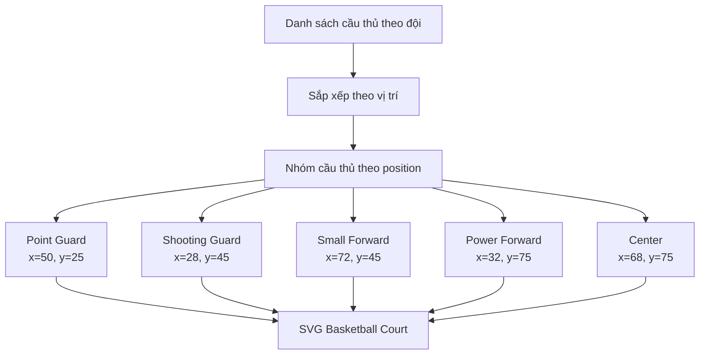

### 2.5.5. Thiết kế giao diện

Trang đội hình gồm hai phần:

- Khu vực sân bóng: hiển thị SVG sân bóng và vị trí cầu thủ.
- Khu vực danh sách cầu thủ: hiển thị thẻ cầu thủ, số áo, vị trí và chỉ số cơ bản.

Giao diện có thiết kế responsive, khi màn hình nhỏ thì các khu vực được xếp theo chiều dọc để dễ xem.

Sơ đồ luồng truy cập trang đội hình:

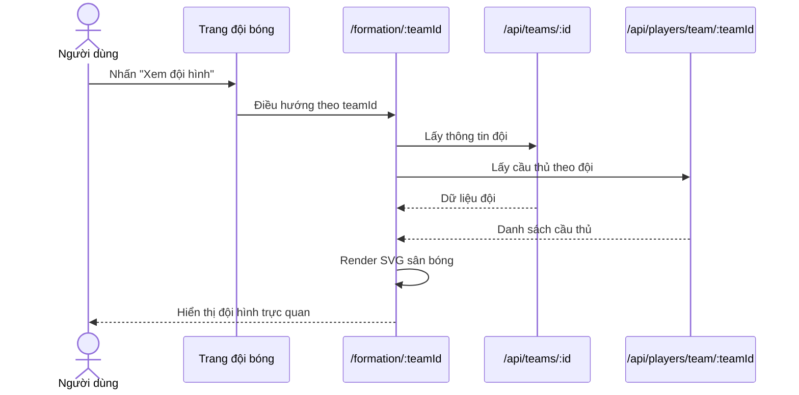

### 2.5.6. Ý nghĩa chức năng

Chức năng trực quan hóa đội hình giúp hệ thống thân thiện hơn với người dùng trong lĩnh vực thể thao. Người xem có thể hình dung nhanh cấu trúc đội hình thay vì chỉ đọc dữ liệu dạng bảng. Đây là cải tiến rõ rệt về trải nghiệm người dùng so với phiên bản Đồ án Công nghệ 1.

## 2.6. Cải tiến giao diện điều hướng

### 2.6.1. Vấn đề của giao diện cũ

Khi số lượng chức năng tăng lên trong Đồ án Công nghệ 2, thanh điều hướng ngang bắt đầu bị quá tải. Các mục menu như đội bóng, cầu thủ, lịch thi đấu, thống kê, xếp hạng, tin tức, xuất dữ liệu, AI trợ lý và quản lý users cùng nằm trên một hàng khiến giao diện bị chèn ép, mất cân đối và khó mở rộng.

### 2.6.2. Giải pháp sidebar

Hệ thống được cải tiến bằng sidebar bên trái. Sidebar có các ưu điểm:

- Các chức năng được xếp dọc, dễ đọc hơn.
- Không bị giới hạn chiều ngang màn hình.
- Dễ thêm chức năng mới trong tương lai.
- Có trạng thái active rõ ràng.
- User menu được đặt cuối sidebar gọn gàng.
- Trên mobile, sidebar có thể trượt ra bằng nút menu.

Sơ đồ bố cục giao diện sau cải tiến:

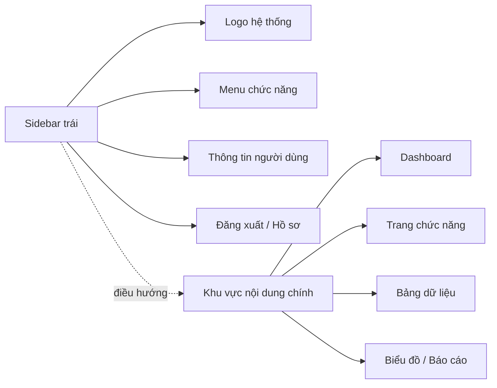

### 2.6.3. Ý nghĩa cải tiến

Cải tiến sidebar giúp giao diện phù hợp hơn với mô hình dashboard quản trị. Đây là thay đổi quan trọng về trải nghiệm người dùng, đặc biệt khi hệ thống ngày càng có nhiều chức năng nâng cao.

## 2.7. Cấu trúc dữ liệu bổ sung

Trong Đồ án Công nghệ 2, cấu trúc dữ liệu mới quan trọng nhất là collection `chats`.

### 2.7.1. Collection chats

Collection `chats` dùng để lưu lịch sử trò chuyện giữa người dùng và AI.

| Trường | Kiểu dữ liệu | Ý nghĩa |
|---|---|---|
| `userId` | ObjectId | Người dùng sở hữu phiên chat |
| `messages` | Array | Danh sách tin nhắn |
| `messages.role` | String | Vai trò: user hoặc assistant |
| `messages.content` | String | Nội dung tin nhắn |
| `messages.timestamp` | Date | Thời điểm gửi tin nhắn |
| `context` | String | Ngữ cảnh phiên chat |
| `createdAt` | Date | Thời gian tạo |
| `updatedAt` | Date | Thời gian cập nhật |

Sơ đồ ERD dữ liệu liên quan đến chức năng mới:

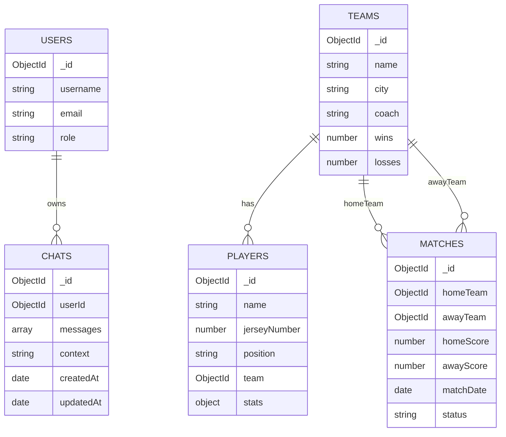

### 2.7.2. Dữ liệu sử dụng lại

Các chức năng mới cũng sử dụng lại các collection đã có:

- `teams`: dùng cho bảng xếp hạng, export PDF, AI context.
- `players`: dùng cho export PDF, AI context, đội hình trực quan.
- `matches`: dùng cho thống kê, export PDF, AI context.
- `users`: dùng để xác định người dùng khi lưu lịch sử chat.

## 2.8. Tổng hợp API endpoint mới

| STT | Method | Endpoint | Chức năng | Quyền |
|---|---|---|---|---|
| 1 | GET | `/api/standings` | Lấy bảng xếp hạng động | User |
| 2 | GET | `/api/standings/team/:teamId` | Thống kê chi tiết theo đội | User |
| 3 | GET | `/api/standings/sos/:teamId` | Tính độ mạnh lịch thi đấu | User |
| 4 | GET | `/api/export/standings` | Xuất PDF bảng xếp hạng | User |
| 5 | GET | `/api/export/teams` | Xuất PDF danh sách đội | User |
| 6 | GET | `/api/export/players` | Xuất PDF danh sách cầu thủ | User |
| 7 | GET | `/api/export/matches` | Xuất PDF lịch thi đấu | User |
| 8 | POST | `/api/ai/chat` | Gửi câu hỏi đến AI | User |
| 9 | GET | `/api/ai/chat/history` | Lấy lịch sử chat | User |
| 10 | DELETE | `/api/ai/chat/clear` | Xóa lịch sử chat | User |
| 11 | GET | `/api/players/team/:teamId` | Lấy cầu thủ theo đội cho trang đội hình | Public (frontend route yêu cầu đăng nhập) |
| 12 | GET | `/api/teams/:id` | Lấy thông tin đội cho trang đội hình | Public (frontend route yêu cầu đăng nhập) |

Sơ đồ nhóm API mới:

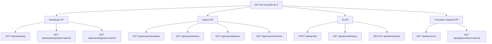

## 2.9. Kết luận chương

Chương 2 đã phân tích và thiết kế các chức năng mới của Đồ án Công nghệ 2. Các chức năng này được xây dựng dựa trên dữ liệu sẵn có của hệ thống nhưng tạo ra giá trị sử dụng mới: bảng xếp hạng hỗ trợ phân tích, PDF hỗ trợ báo cáo, AI hỗ trợ hỏi đáp thông minh và đội hình SVG hỗ trợ trực quan hóa dữ liệu thể thao.

---

# CHƯƠNG 3: TRIỂN KHAI, KIỂM THỬ VÀ ĐÁNH GIÁ

## 3.1. Giới thiệu chương

Chương này trình bày quá trình triển khai, kiểm thử và đánh giá các chức năng mới đã phát triển trong Đồ án Công nghệ 2. Nội dung tập trung vào kết quả thực hiện, cách kiểm thử và mức độ đáp ứng mục tiêu ban đầu.

## 3.2. Môi trường triển khai

Hệ thống được triển khai trong môi trường phát triển cục bộ với các thành phần:

| Thành phần | Công nghệ |
|---|---|
| Frontend | React.js |
| Backend | Node.js, Express.js |
| Database | MongoDB, Mongoose |
| Biểu đồ | Recharts |
| Xuất PDF | PDFKit |
| AI chatbot | Groq SDK |
| Xác thực | JWT |
| Công cụ phát triển | Visual Studio Code, npm |

Các lệnh chạy hệ thống:

```bash
cd backend
npm start
```

```bash
cd frontend
npm start
```

Sơ đồ triển khai cục bộ:

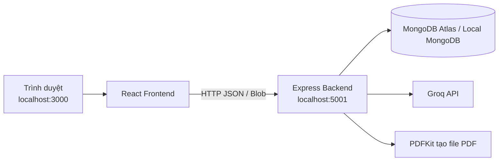

## 3.3. Kết quả triển khai chức năng bảng xếp hạng động

Chức năng bảng xếp hạng đã được triển khai hoàn chỉnh tại frontend route `/standings` và backend route `/api/standings`.

Kết quả đạt được:

- Hiển thị danh sách đội theo thứ hạng.
- Tính tổng trận, số trận thắng, số trận thua và tỷ lệ thắng.
- Sắp xếp đội theo tỷ lệ thắng giảm dần.
- Hiển thị các thẻ tổng quan gồm đội dẫn đầu, số đội, tổng lượt trận và tỷ lệ thắng trung bình.
- Có nút cập nhật dữ liệu.
- Có giao diện bảng responsive.

Chức năng này giúp người dùng có cái nhìn tổng quan về phong độ của các đội trong giải đấu.

## 3.4. Kết quả triển khai chức năng xuất PDF

Chức năng xuất PDF đã được triển khai tại frontend route `/export` và backend route `/api/export`.

Kết quả đạt được:

- Xuất được báo cáo bảng xếp hạng.
- Xuất được báo cáo danh sách đội bóng.
- Xuất được báo cáo danh sách cầu thủ.
- Xuất được báo cáo lịch thi đấu.
- File được tải trực tiếp về máy người dùng.
- Backend tạo PDF bằng stream, không cần lưu file tạm trên server.
- API export được bảo vệ bằng middleware xác thực.

Chức năng này giúp hệ thống đáp ứng nhu cầu lưu trữ và chia sẻ dữ liệu dưới dạng tài liệu.

## 3.5. Kết quả triển khai chức năng AI chatbot

Chức năng AI chatbot đã được triển khai tại frontend route `/chat` và backend route `/api/ai`.

Kết quả đạt được:

- Người dùng có thể nhập câu hỏi trên giao diện chat.
- AI trả lời bằng tiếng Việt dựa trên dữ liệu trong hệ thống.
- Backend lấy dữ liệu đội, cầu thủ và trận đấu để tạo ngữ cảnh.
- Lịch sử trò chuyện được lưu theo từng người dùng.
- Người dùng có thể xóa lịch sử chat.
- Hệ thống giới hạn số tin nhắn lưu trong ngữ cảnh để tránh quá tải.

Ví dụ câu hỏi có thể sử dụng:

```text
Cầu thủ nào ghi điểm nhiều nhất?
```

```text
Đội nào đang có tỷ lệ thắng cao nhất?
```

```text
Hãy nhận xét phong độ của Saigon Heat.
```

Chức năng này làm tăng tính hiện đại của hệ thống và thể hiện khả năng tích hợp AI vào ứng dụng quản lý.

## 3.6. Kết quả triển khai chức năng đội hình trực quan

Chức năng đội hình trực quan đã được triển khai tại route `/formation/:teamId`.

Kết quả đạt được:

- Người dùng có thể mở trang đội hình từ trang đội bóng.
- Hệ thống lấy danh sách cầu thủ theo đội.
- Cầu thủ được sắp xếp theo vị trí bóng rổ.
- Sân bóng được vẽ bằng SVG.
- Số áo cầu thủ được hiển thị trực tiếp trên sân.
- Danh sách cầu thủ bên cạnh sân hiển thị thêm vị trí và chỉ số.
- Giao diện hoạt động tốt trên màn hình desktop và mobile.

Chức năng này giúp dữ liệu cầu thủ được trình bày sinh động hơn, phù hợp với đặc thù của một website quản lý bóng rổ.

## 3.7. Kiểm thử chức năng mới

### 3.7.1. Kiểm thử bảng xếp hạng

| Trường hợp kiểm thử | Kết quả mong đợi | Kết quả |
|---|---|---|
| Truy cập `/standings` khi đã đăng nhập | Hiển thị bảng xếp hạng | Đạt |
| Đội có số trận khác nhau | Tính đúng tổng trận | Đạt |
| Đội có tỷ lệ thắng khác nhau | Sắp xếp giảm dần | Đạt |
| Nhấn nút cập nhật | Tải lại dữ liệu mới | Đạt |

Sơ đồ quy trình kiểm thử tổng quát các chức năng mới:

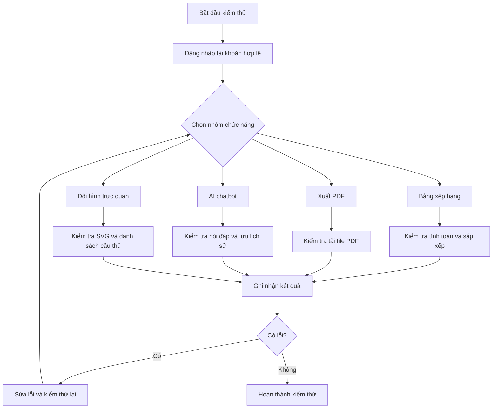

### 3.7.2. Kiểm thử xuất PDF

| Trường hợp kiểm thử | Kết quả mong đợi | Kết quả |
|---|---|---|
| Xuất PDF bảng xếp hạng | Tải file `standings.pdf` | Đạt |
| Xuất PDF đội bóng | Tải file `teams-report.pdf` | Đạt |
| Xuất PDF cầu thủ | Tải file `players-report.pdf` | Đạt |
| Xuất PDF lịch thi đấu | Tải file `matches-report.pdf` | Đạt |
| Chưa đăng nhập gọi API export | Bị chặn bởi middleware | Đạt |

### 3.7.3. Kiểm thử AI chatbot

| Trường hợp kiểm thử | Kết quả mong đợi | Kết quả |
|---|---|---|
| Gửi câu hỏi hợp lệ | AI trả về câu trả lời | Đạt |
| Gửi câu hỏi rỗng | Backend từ chối request | Đạt |
| Mở lại trang chat | Hiển thị lịch sử chat | Đạt |
| Xóa lịch sử chat | Danh sách tin nhắn rỗng | Đạt |
| Thiếu `GROQ_API_KEY` | Trả lỗi cấu hình rõ ràng | Đạt |

### 3.7.4. Kiểm thử đội hình trực quan

| Trường hợp kiểm thử | Kết quả mong đợi | Kết quả |
|---|---|---|
| Mở đội có cầu thủ | Hiển thị sân và danh sách cầu thủ | Đạt |
| Đội thiếu vị trí nào đó | Vị trí trống được hiển thị | Đạt |
| Nhấn quay lại | Trở về trang đội bóng | Đạt |
| Xem trên màn hình nhỏ | Bố cục chuyển dọc | Đạt |

## 3.8. Đánh giá kết quả đạt được

Sau giai đoạn Đồ án Công nghệ 2, hệ thống đã được nâng cấp đáng kể so với phiên bản cũ.

Các kết quả nổi bật:

- Hệ thống có thêm khả năng phân tích dữ liệu thông qua bảng xếp hạng.
- Người dùng có thể xuất dữ liệu thành báo cáo PDF.
- AI chatbot giúp tương tác với dữ liệu bằng ngôn ngữ tự nhiên.
- Đội hình cầu thủ được hiển thị trực quan trên sân bóng.
- Giao diện điều hướng được cải thiện bằng sidebar, phù hợp với hệ thống có nhiều chức năng.
- Các chức năng mới được tích hợp vào hệ thống hiện có mà không phá vỡ cấu trúc cũ.

## 3.9. Hạn chế còn tồn tại

Mặc dù các chức năng mới đã hoàn thành, hệ thống vẫn còn một số hạn chế:

- Báo cáo PDF mới hỗ trợ định dạng cơ bản, chưa có biểu đồ trực tiếp trong file PDF.
- AI chatbot phụ thuộc vào Groq API và cần cấu hình `GROQ_API_KEY`.
- Dữ liệu ngữ cảnh gửi cho AI còn giới hạn ở đội bóng, cầu thủ và trận đấu gần đây.
- Trang đội hình chọn cầu thủ đầu tiên theo từng vị trí, chưa hỗ trợ kéo thả hoặc tùy chỉnh đội hình chiến thuật.
- Chức năng bảng xếp hạng chủ yếu dựa trên dữ liệu thắng thua trong collection đội, chưa tự động tính toàn bộ từ lịch sử trận trong mọi trường hợp.

## 3.10. Hướng phát triển tiếp theo

Trong các giai đoạn sau, hệ thống có thể tiếp tục phát triển:

- Bổ sung xuất Excel bên cạnh PDF.
- Thêm biểu đồ vào file báo cáo PDF.
- Cho phép kéo thả cầu thủ để tạo đội hình chiến thuật.
- Mở rộng AI chatbot để trả lời sâu hơn về từng cầu thủ, từng trận và xu hướng phong độ.
- Tích hợp thông báo trận đấu sắp diễn ra.
- Bổ sung phân trang cho danh sách dữ liệu lớn.
- Ghi lịch sử thao tác để phục vụ kiểm tra và quản trị.
- Tối ưu giao diện responsive trên nhiều kích thước màn hình.

---

# TỔNG KẾT BÁO CÁO

Đồ án Công nghệ 2 đã kế thừa nền tảng Website Quản Lý Bóng Rổ từ Đồ án Công nghệ 1 và tập trung phát triển các chức năng nâng cao. Báo cáo không trình bày lại các chức năng cơ bản như xác thực, phân quyền hay CRUD dữ liệu, mà tập trung vào những phần mới được bổ sung theo kế hoạch phát triển.

Các chức năng mới đã hoàn thành gồm bảng xếp hạng động, xuất báo cáo PDF, trợ lý AI bóng rổ và trực quan hóa đội hình. Những chức năng này giúp hệ thống trở nên trực quan, thông minh và có tính ứng dụng thực tế cao hơn. Bảng xếp hạng giúp phân tích thành tích đội bóng; xuất PDF hỗ trợ lưu trữ và chia sẻ dữ liệu; AI chatbot giúp người dùng hỏi đáp thông tin nhanh chóng; trang đội hình giúp hiển thị dữ liệu cầu thủ sinh động hơn.

Về mặt kỹ thuật, hệ thống tiếp tục sử dụng nền tảng MERN Stack và bổ sung thêm các công nghệ như PDFKit, Groq SDK, Recharts và SVG. Các chức năng mới được tích hợp thông qua các API RESTful rõ ràng, có kiểm tra xác thực và có giao diện riêng trên frontend.

Nhìn chung, Đồ án Công nghệ 2 đã đạt được mục tiêu nâng cấp hệ thống từ một website quản lý dữ liệu cơ bản thành một dashboard quản lý bóng rổ có khả năng báo cáo, phân tích, trực quan hóa và tương tác thông minh. Đây là nền tảng tốt để tiếp tục phát triển hệ thống theo hướng chuyên nghiệp hơn trong tương lai.

---

# TÀI LIỆU THAM KHẢO

1. Node.js Documentation, https://nodejs.org
2. Express.js Documentation, https://expressjs.com
3. MongoDB Manual, https://www.mongodb.com/docs
4. Mongoose Documentation, https://mongoosejs.com
5. React Documentation, https://react.dev
6. React Router Documentation, https://reactrouter.com
7. Recharts Documentation, https://recharts.org
8. PDFKit Documentation, https://pdfkit.org
9. Groq API Documentation, https://console.groq.com/docs
10. Mozilla Developer Network, JavaScript Documentation, https://developer.mozilla.org
